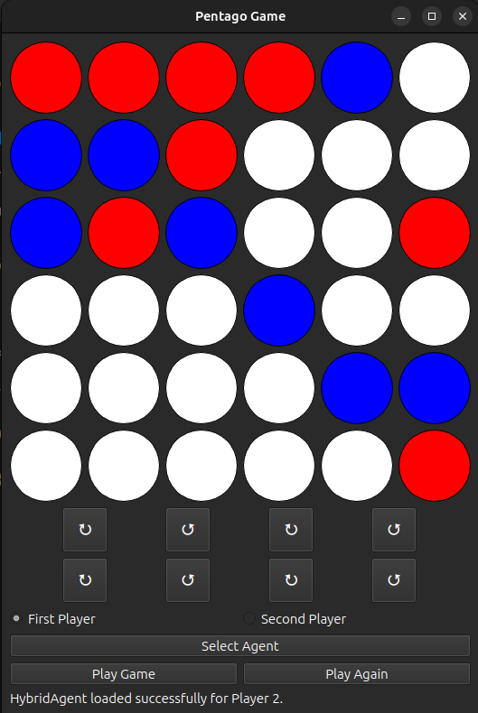

# Pentago with Reinforcement Learning

An AI-powered Pentago board game complete with a graphical user interface (GUI) and reinforcement learning (RL) agents. This project demonstrates how to integrate RL algorithms into a game setting using Python, PyTorch, and PyQt6.



## Table of Contents

- [Overview](#overview)
- [Features](#features)
- [Installation](#installation)
- [Usage](#usage)
- [Project Structure](#project-structure)
- [How It Works](#how-it-works)
  - [Game Environment](#game-environment)
  - [Reinforcement Learning Agents](#reinforcement-learning-agents)
  - [Graphical User Interface (GUI)](#graphical-user-interface-gui)
- [Customization & Training](#customization--training)
- [Contributing](#contributing)
- [License](#license)
- [Acknowledgements](#acknowledgements)

## Overview

Pentago is a two-player abstract strategy game played on a 6×6 board, where each player aims to align five marbles in a row. In this project, various reinforcement learning agents learn and make decisions to play the game. The project provides a user-friendly GUI for playing against these AI agents, serving as an excellent example of applying reinforcement learning to game AI.


## Features

- **Multiple RL Agents:**  
  Choose between four agent types:
  - **DDQN:** Uses Double Deep Q-Network with the `PentagoEnv` environment.
  - **DDQN2:** A variant of DDQN using an alternative environment (`PentagoEnv2`).
  - **Hybrid:** Combines elements of multiple RL strategies.
  - **Hybrid2:** A variant of Hybrid that uses the second environment for game dynamics.

- **Graphical User Interface (GUI):**  
  Built with PyQt6, the GUI allows you to:
  - Place marbles on the board.
  - Rotate one of the four board quadrants (clockwise or anticlockwise).
  - Select the starting player (human or AI).
  - Choose between different pre-trained agents.

- **Pre-Trained Agents:**  
  Agents load their trained models from the `saved_agents` directory. The code supports loading different state dictionaries for player 1 and player 2, enabling asymmetrical gameplay.

- **Real-Time Gameplay:**  
  The game alternates turns between the human and AI players with visual feedback and delay managed by PyQt6’s QTimer.

## Installation

### Prerequisites

Make sure you have the following installed:
- **Python 3.6 or higher**
- **PyTorch**
- **PyQt6**
- **NumPy**
- **gym**

### Setup Steps (with Bash)

1. **Clone the Repository**
Open your terminal and run:
```bash
git clone https://github.com/aramiracle/pentago_with_rl.git
cd pentago_with_rl
```
2. **Create a Virtual Environment (Optional but Recommended)**
It’s a good idea to use a virtual environment:
```bash
python3 -m venv venv
source venv/bin/activate   # On Windows use: venv\Scripts\activate
```
3. **Install Dependencies**
There is a `requirements.txt` file available, run:
```bash
pip install -r requirements.txt
```
## Usage
### Running the Game
To launch the game, navigate to the app directory and run the main script:
```bash
cd app
python main.py
```
## Gameplay Steps (Bash Explanation)

### Agent Selection:
When the game starts, click the "Select Agent" button in the GUI to choose your RL agent. The system will prompt you to load a pre-trained model from the saved_agents folder.

### Player Choice:
Use the provided radio buttons to select whether you want to play as the first or second player.

### Start Game:
Click the "Play Game" button to begin. If the AI is set to start, it will automatically execute its move after a short delay.

### Board Interaction:
Placing Marbles: Click on an empty cell in the 6×6 grid.
Rotating Board Parts: Click the rotation buttons (displayed with "↻" for clockwise and "↺" for anticlockwise) to rotate the corresponding quadrant.

### Game Outcome:
The game continuously checks for a win or a draw. When the game ends, a pop-up message shows the result.

## Project structure
```graphql
pentago_with_rl/
├── app/                    
│   ├── main.py           # Main application script with the GUI and game loop.
│   ├── environment.py    # Defines the PentagoEnv (game logic and rules).
│   ├── environment2.py   # Alternative game environment (PentagoEnv2).
│   ├── ddqn/             # Contains the DDQNAgent implementation.
│   ├── ddqn2/            # Contains the DDQN2Agent implementation.
│   ├── hybrid/           # Contains the HybridAgent implementation.
│   └── hybrid2/          # Contains the Hybrid2Agent implementation.
├── saved_agents/         # Directory for pre-trained model checkpoints.
├── .gitignore            # Files and folders to ignore in Git.
└── README.md             # This file.
```

## How It Works

### Game Environment

The game logic is handled by `environment.py` and `environment2.py`. These files define:
- **Board Representation:** The board is stored as a NumPy array (or PyTorch tensor).
- **Reset Function:** `reset()` resets the board to its initial state.
- **Win Check:** `check_win(player)` checks if a player has aligned five marbles.
- **Draw Check:** `check_draw()` verifies if the board is full without any win.

### Reinforcement Learning Agents

Four types of RL agents are implemented:
- **DDQNAgent & DDQN2Agent:**  
  These agents use Double Deep Q-Networks. They determine actions based on the current board state and update their models using PyTorch's `load_state_dict`.

- **HybridAgent & Hybrid2Agent:**  
  These agents blend different RL strategies, such as policy gradients and Q-learning, to make decisions. They have similar structures to the DDQN variants but incorporate additional heuristics.

Each agent implements a `select_action(board, epsilon=0)` method to decide the next move. The selected action is then translated into a board move (placing a marble and rotating a quadrant).

### Graphical User Interface (GUI)

Built with PyQt6, the GUI handles:
- **Board Rendering:**  
  A grid of 6×6 buttons visually represents the game board.
- **User Input:**  
  Click events on buttons allow marble placements and board rotations.
- **Game Flow Management:**  
  The GUI uses QTimer to alternate between human and AI turns, providing a smooth gameplay experience.

## Customization & Training
- **Training Your Own Agent:**
You can modify the RL training code (located in the agent subdirectories) to experiment with different architectures, hyperparameters, or training methods.
- **Extending the Environment:**
You can add new game rules or modes by modifying `PentagoEnv` and `PentagoEnv2`.