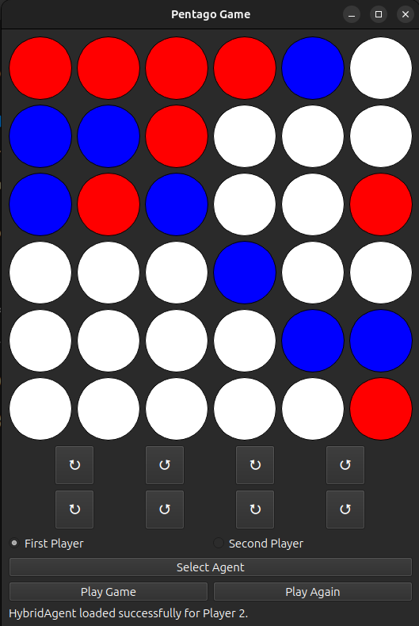

# Pentago(board game) AI with Deep Reinforcement Learning

This project showcases the implementation of a Pentago game featuring an intuitive Graphical User Interface (GUI), where the adversary is an Artificial Intelligence (AI) honed through the utilization of diverse Deep Reinforcement Learning (DRL) models. Among these models are two distinct structures for Deep Q-Networks (DQN), contributing to a multifaceted and sophisticated AI opponent. The AI evolves its gameplay through a process of self-training, progressively refining its strategic decision-making abilities. Importantly, the AI not only adapts to varying game scenarios but also retains its acquired knowledge and strategies for competitive engagement against human players, ensuring a dynamic and challenging gaming experience.



## Scripts Overview

### `gui.py` Pentago Game GUI Summary

This script employs PyQt6 to create a graphical user interface (GUI) for the Pentago game. Key features include:

- **PentagoGame Class (QWidget):**
  - Creates the main window for the Pentago game, initializing UI elements like the game board grid, rotation buttons, and status messages.
- **UI Initialization:**
  - Organizes the game board and rotation buttons using QGridLayout.
  - Represents the game board with buttons using a 2D array (`board`).
  - Configures click events for board buttons to trigger the `board_button_clicked` method.
  - Configures click events for rotation buttons to trigger the `rotate_board_part` method.
- **Board Button Click Handling (`board_button_clicked` method):**
  - Updates the game board upon a valid move by a player.
  - Toggles between player colors (blue and red) for each move.
  - Disables board buttons after a valid move until rotation.
- **Rotation Button Click Handling (`rotate_board_part` method):**
  - Rotates the specified corner of the game board clockwise or counterclockwise.
  - Enables board buttons after rotation.
  - Checks for win or draw conditions after each rotation.
- **Win Condition Check (`check_win` method):**
  - Examines win conditions in all directions (horizontal, vertical, and diagonal) for the current player.
- **Counting Consecutive Pieces (`count_aligned` method):**
  - Determines a win by counting consecutive pieces in a specific direction.
- **Counting in a Single Direction (`count_direction` method):**
  - Counts pieces in a single direction to check for win conditions.
- **Draw Condition Check (`check_draw` method):**
  - Verifies draw conditions when the entire board is filled.
- **Result Display (`show_result` method):**
  - Displays a message box indicating the game result (win or draw) after each rotation.
- **Example Usage:**
  - Initializes the PyQt application, creates the PentagoGame window, and starts the application loop.

This script provides a graphical interface for playing Pentago, featuring player turns, rotation of game board quadrants, win detection, and draw conditions.

### `main.py` Pentago Game Playing GUI with AI Detailed Summary

- **PentagoGame Class (QMainWindow):**
  - Creates the main window for the Pentago game, initializing UI elements such as the game board grid, rotation buttons, and player controls.
  - Manages the game's central logic and user interface.
  - Handles events for player moves, AI actions, and rotation of game board quadrants.

- **UI Initialization:**
  - Organizes the game board, rotation buttons, and player controls using QGridLayout and QHBoxLayout.
  - Represents the game board with buttons using a 2D array (`board_buttons`).
  - Configures click events for board buttons and rotation buttons to trigger corresponding methods.

- **Game Control Buttons:**
  - Includes "Play Game" and "Play Again" buttons, allowing the user to start a new game or play again after completion.
  - Linked to methods that control the flow of the game and initialize necessary settings.

- **Player and Agent Selection:**
  - Enables the selection of the player (First Player or Second Player) and the AI agent type (DDQN, DDQN2, Hybrid, Hybrid2) through radio buttons and a button for agent selection.
  - Utilizes radio buttons for player selection and a button to trigger the agent selection dialog.

- **AI Integration:**
  - Utilizes AI agents (DDQNAgent, DDQN2Agent, HybridAgent, Hybrid2Agent) to play turns based on the selected agent type.
  - Allows loading pre-trained agents from specified files using the `load_agent` method.
  - Handles AI moves and updates the game state accordingly.

- **Game Flow Control:**
  - Manages the flow of the game, including player turns, AI moves, and rotation of game board quadrants.
  - Displays game status messages in the status label, informing users about the current state of the game.
  - Determines the winner or a draw condition and shows the result in a message box.

- **Example Usage:**
  - Initializes the PyQt application, creates the PentagoGame window, and starts the application loop with the `main` function.

### PentagoEnv and PentagoEnv2 Comparison

#### Similarities

1. **Game Initialization:**
   - Both environments initialize the Pentago board as a 6x6 grid.
   - They track the current player, winner, valid move, game state, and other relevant attributes.

2. **Reset Method:**
   - The `reset` method in both environments resets the Pentago board to its initial state.
   - Clears game-related attributes to start a new game.

3. **Step Method:**
   - The `step` method in both environments takes an action as input and applies it to the Pentago environment.
   - Updates the game state, checks for win/draw conditions, and returns the new state, reward, and game termination status.

4. **Reward, Done, Info Calculation:**
   - Both environments calculate the reward, termination status, and additional information based on the current game state.
   - Handle win, draw, and ongoing game scenarios.

5. **Render Method:**
   - The `render` method in both environments displays the current Pentago board in the console for debugging and visualization purposes.

6. **Win and Draw Checking:**
   - Both environments implement methods to check for a win condition and draw condition.
   - Include methods to count aligned pieces in different directions.

7. **Board Rotation:**
   - Define methods for rotating parts of the game board based on user actions.

8. **Valid Actions and Action Validation:**
   - Both determine valid actions for the current game state.
   - Check the validity of actions to prevent illegal moves.

9. **Action-to-Move Conversion:**
   - Both environments provide methods to convert actions to corresponding (row, col, rotation) values for better interpretation.

10. **Clone Method:**
   - The `clone` method creates a copy of the current environment, allowing for simulations and AI training.

#### Differences

1. **Action Space:**
   - `PentagoEnv` has a Tuple action space `(gym.spaces.Discrete(36), gym.spaces.Discrete(8))`, representing board buttons and rotations separately.
   - `PentagoEnv2` has a single Discrete action space `gym.spaces.Discrete(36 * 8)`, combining board buttons and rotations into a single integer.

2. **Observation Space:**
   - `PentagoEnv` has a Box observation space `(low=0, high=2, shape=(6, 6), dtype=np.float32)`, representing the 6x6 game board with float values.
   - `PentagoEnv2` has the same observation space configuration.

3. **Action Representation:**
   - In `PentagoEnv`, actions are represented as a Tuple `(board_button, rotation)`.
   - In `PentagoEnv2`, actions are represented as a single integer, with board_button and rotation derived through division and modulo operations.

4. **Action Validity Checking:**
   - In `PentagoEnv`, the `is_valid_action` method checks the validity of actions based on the selected cell's emptiness.
   - In `PentagoEnv2`, the `is_valid_action` method checks the validity of actions using divmod to decode board_button and rotation.

5. **Action-to-Move Conversion:**
   - In `PentagoEnv`, the `action_to_move` method converts actions to corresponding (row, col, rotation) values.
   - In `PentagoEnv2`, the `action_to_move` method performs the same conversion, considering the single integer action representation.

6. **Action Space Size:**
   - `PentagoEnv` has a smaller action space size due to the separation of board buttons and rotations.
   - `PentagoEnv2` has a larger action space size, combining board buttons and rotations into a single integer.

These differences mainly revolve around the representation and handling of actions in the Gym environment, affecting the action space and related methods. The core game logic and structure remain similar between the two environments.

### DDQN Scripts: `ddqn.py` and `ddqn2.py`

-  **`ddqn.py` Script Summary:**

- **Dependencies:**
  - Imports necessary libraries such as PyTorch, torch.nn, torch.optim, collections, tqdm, and random.
  - Imports the `PentagoEnv` environment from the `app.environment` module.

- **Dueling DQN Model:**
  - Defines the `DuelingDQN` class, implementing a PyTorch neural network with shared layers and separate streams for board button and rotation actions.

- **Experience Replay Buffer:**
  - Implements the `ExperienceReplayBuffer` class using a deque to store and sample experiences.

- **DDQNAgent:**
  - Defines the `DDQNAgent` class, initializing the agent with a Dueling DQN model, target model, and experience replay buffer.
  - Implements methods for action selection (`select_action`) and training (`train_step`).

- **Training Loop:**
  - Provides a training loop function (`agent_vs_agent_train`) for agent vs. agent scenarios using the Pentago environment.
  - Handles episode iterations, action selection, experience accumulation, and training steps.

- **Loading and Saving Agents:**
  - Implements a function (`load_ddqn_agent`) to load a pre-trained agent from a checkpoint.
  - Example usage showcases loading, continued training, and saving of trained agents.

- **`ddqn2.py` Script Summary**

- **Dependencies:**
  - Similar imports to `ddqn.py`, including PyTorch modules, collections, tqdm, and random.
  - Imports the `PentagoEnv2` environment from the `app.environment2` module.

- **Modified Dueling DQN Model:**
  - Defines a modified `DuelingDQN` class, simplifying the model to output a single tensor for the combined action space.

- **Experience Replay Buffer and DDQN2Agent:**
  - Similar to `ddqn.py`, implements the `ExperienceReplayBuffer` class and defines the `DDQN2Agent` class with necessary methods.

- **Training Loop and Loading/Saving Agents:**
  - Shares similarities with `ddqn.py` in terms of the training loop structure, loading agents, and saving trained agents.

#### Similarities

- Both scripts utilize PyTorch for neural network implementations and training processes.
- Experience replay buffers are used in both scripts to store and sample experiences.
- The training loops follow a similar structure, involving episodes, action selection, and agent updates.
- Loading and saving agents involve comparable functions (`load_ddqn_agent` and `load_ddqn2_agent`).

#### Differences

- In `ddqn.py`, the Dueling DQN model has separate streams for board button and rotation actions.
- In `ddqn2.py`, the Dueling DQN model is modified to output a single tensor for the combined action space.
- While both scripts involve training agents, `ddqn.py` focuses on Pentago gameplay between two agents.
- `ddqn2.py` has a similar setup but with a modified environment (`PentagoEnv2`) and emphasis on agent training.

### Hybrid Scripts: `hybrid.py` and `hybrid2.py`

- **`hybrid.py` Script Summary**

- **Dependencies:**
  - Imports necessary libraries such as PyTorch, torch.nn, torch.optim, collections, tqdm, and random.
  - Imports the `PentagoEnv` environment from the `app.environment` module.

- **Dueling DQN Model:**
  - Defines the `DuelingDQN` class, implementing a PyTorch neural network with shared layers and separate streams for board button and rotation actions.
  - Utilizes ReLU activation functions for intermediate layers.
  - Combines value and advantage streams to calculate Q-values for board button and rotation actions.

- **Experience Replay Buffer:**
  - Implements the `ExperienceReplayBuffer` class using a deque to store and sample experiences.

- **HybridAgent:**
  - Defines the `HybridAgent` class, initializing the agent with a Dueling DQN model, target model, and experience replay buffer.
  - Implements methods for action selection (`select_action`), checking instant wins (`is_instant_win`), and training (`train_step`).
  - Uses Double Q-learning with target model for action selection.
  - Updates target model parameters periodically.

- **Training Loop:**
  - Provides a training loop function (`agent_vs_agent_train`) for agent vs. agent scenarios using the Pentago environment.
  - Handles episode iterations, action selection, experience accumulation, and training steps.
  - Displays training progress using the tqdm library.

- **Loading and Saving Agents:**
  - Implements a function (`load_ddqn_agent`) to load a pre-trained agent from a checkpoint.
  - Example usage showcases loading, continued training, and saving of trained agents.

- **`hybrid2.py` Script Summary**

- **Dependencies:**
  - Similar imports to `hybrid.py`, including PyTorch modules, collections, tqdm, and random.
  - Imports the `PentagoEnv2` environment from the `app.environment2` module.

- **Modified Dueling DQN Model:**
  - Defines a modified `DuelingDQN` class, simplifying the model to output a single tensor for the combined action space.
  - Uses ReLU activation functions for intermediate layers.

- **Experience Replay Buffer and Hybrid2Agent:**
  - Similar to `hybrid.py`, implements the `ExperienceReplayBuffer` class and defines the `Hybrid2Agent` class with necessary methods.
  - Uses a simplified Dueling DQN model with a combined action space.

- **Training Loop and Loading/Saving Agents:**
  - Shares similarities with `hybrid.py` in terms of the training loop structure, loading agents, and saving trained agents.
  - Utilizes Double Q-learning for training, similar to `hybrid.py`.

#### Similarities

- Both scripts utilize PyTorch for neural network implementations and training processes.
- Experience replay buffers are used in both scripts to store and sample experiences.
- The training loops follow a similar structure, involving episodes, action selection, and agent updates.
- Loading and saving agents involve comparable functions (`load_ddqn_agent` and `load_agent`).

#### Differences

- In `hybrid.py`, the Dueling DQN model has separate streams for board button and rotation actions.
- In `hybrid2.py`, the Dueling DQN model is modified to output a single tensor for the combined action space.
- While both scripts involve training agents, `hybrid.py` focuses on Pentago gameplay between two agents.
- `hybrid2.py` has a similar setup but with a modified environment (`PentagoEnv2`) and emphasis on agent training.

### Pentago Game AI Evaluation

- **Introduction**
  - The `test_{model}.py` script evaluates the performance of a DDQNAgent against a Random Bot in the Pentago game environment.

#### Components

- **Environment Setup**
  - Imports necessary libraries and the Pentago environment.

- **Random Bot Definition**
  - Defines a `RandomBot` class for generating random actions.

- **Game Simulation**
  - Simulates a single game between two AI agents or an AI agent and a random bot.

- **Testing AI vs. Random Bot**
  - Tests an AI agent against a random bot over a specified number of games.

- **Testing Random Bot vs. AI**
  - Tests a random bot against an AI agent over a specified number of games.

- **Main Execution**
  - Loads AI agent models and creates a RandomBot.
  - Executes test scenarios and prints detailed results.

- **Execution Instructions**
  1. Install dependencies.
  2. Ensure the Pentago game environment is set up.
  3. Load trained DDQNAgent models.
  4. Run the script to evaluate AI agent performance

## Performance
  - The Hybrid Dueling DQN agent stands out with an outstanding 97% win rate against the `random_bot`, showcasing exceptional performance.


## Installation

Ensure you have Python 3.6 or higher and pip installed on your system. To install the required libraries for the Connect Four AI, execute the following command in your terminal:

```
pip install -r reqirement.txt
```
This command will install PyQt6 for the GUI, PyTorch for deep learning algorithms, Gym for the game environment, NumPy for numerical computations, and tqdm for progress bars during training and testing.

## Usage

First, set the python path in the terminal by running:

```
export PYTHONPATH=$PWD
```

### Training the AI

To train the AI model, run one of the following scripts depending on the version of DQN you want to use:

For the standard DQN as an example:

```
python dqn.py
```

### Playing Game with AI

After training, you can start a game against the AI by executing:
```
python main.py
```
Also trained models are saved in saved_model directory.

### Testing the AI

To evaluate the AI's performance against a random bot, example of use:
```
python test_ddqn.py
```
This script will simulate games and provide statistics on the AI's performance.
